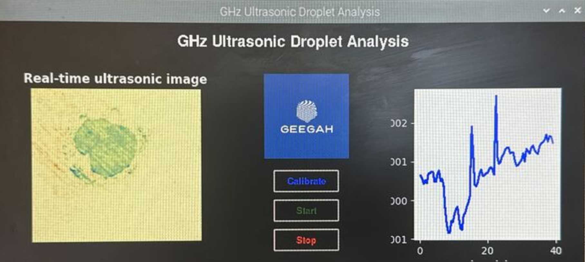

# Droplet-ejector-GUI
A GUI for RPi4 that controls RP2040 imager unit attached to droplet ejector. 

# Introduction
This repository contains Python scripts for a GUI for GHz ultrasonic imager (RP2040) connected to a Raspberry Pi 4 system. The scripts handle data acquisition, real-time visualization, as well as further processed averaged pixel plots of the ultrasonic imaging data. There are two plot windows in this GUI: one showing the processed ultrasonic image (Magnitude/V with baseline adjusted) and the other plotting average of all pixels vs time that updates as new images are captured in real-time. 

# Features
These scripts are designed to:
1. Initialize the ultrasonic imager settings
2. On-demand acquisition of the background frame (calibration)
3. Acquire ultrasonic data and store them in a new directory for each experiment/run
4. Plot the real-time 2D Magntidue and the average of all pixels in two separate plots that updates in real-time

# Prerequisites
Before you use any of the scripts, ensure you have the following installed in your RPi4:
1. Python 3. x installed'
2. Python library specific to RP2040 connections: spidev, RPi.GPIO, serial
3. Python libraries for operations and GUI: sys, os, time, math, NumPy, tkinter
4. Python libraries for image generation, visualization, and analysis: matplotlib

Before installing any new modules

Python 3 is usually pre-installed on RPi4. You can check by running:

```bash
python3 --version
```
If not installed, you can install it using:

```bash
sudo apt-get update
sudo apt-get install python3
```

You can combine the commands to install everything in one go:
```bash
sudo apt-get install python3 python3-spidev python3-rpi.gpio python3-serial python3-numpy python3-tk python3-matplotlib
```

Else, you can follow step-wise installation of individual modules:


Python libraries specific to RP2040 connections: spidev, RPi.GPIO, serial
```bash
sudo apt-get install python3-spidev
sudo apt-get install python3-rpi.gpio
sudo apt-get install python3-serial
```

Python libraries for operations and GUI: sys, os, time, math, NumPy, tkinter

```bash
sudo apt-get install python3-numpy
sudo apt-get install python3-tk
```

Python libraries for image generation, visualization, and analysis: matplotlib

```bash
sudo apt-get install python3-matplotlib
```

# Getting started: 

**Clone the repository**
```bash
git clone git@github.com:Geegah-Inc/Geegah-RP2040.git
```

**Running the GUI manually**
```bash
python3 frontend_run_GUI.py
```

**Snapshot of the GUI on RPi4**



# Scripts: acquisition_backend.py
Responsible for initializing the ultrasonic sensor settings, acquiring frames of data, processing these frames, and providing methods for calibration and real-time data acquisition. This will be directly used by the ***frontend_run_GUI.py***. Here are more details on the individual functions in this script and their purposes. 

**Functions in use**

1. **load_sensor_settings(ser, freq_target_MHz, timing, mode=1, adc=1)**
* Purpose: Loads imager settings and initializes GPIO and SPI configurations. Similarly, it also loads the imaging mode, and sets a timing of echo acquisition.
* Parameters:
  * ser (serial.Serial): Serial communication object i.e. RP2040
  * freq_target_MHz (int): Pulse frequency in MHz.
  * timing (int): Timing (ns) at which the echo is acquiring. This exact timing refers to a time (in ns) after RX is enabled/TX is disabled. 
  * mode (int, optional): Timing mode setting (default is 1). Mode = 1 refers to acquisition of echo at only 1 timing. Mode = 0 refers to toggling of acquisition between timing (1st echo) and 450 ns (timing at which the echo dies off). Mode = 2 refers to sample and hold sweep i.e. acquires echo initially at the given timing (ns), followed by second frame acquired at timing + 5ns, third frame acquired at timing + 10ns, and so on. Every new frame will be sampled at a timing which is 5 ns greater than the previous timing. The saturation takes place at 450 ns i.e. every frame after that will still represent acquisition of echo at 450ns after RX enable/TX disable. 
  * adc (int, optional): ADC setting (default is 1).
* Returns: Tuple containing the SPI object for the PICO and the block read size in bytes.

2. **acquire_frame(spi_obj_pico, n_bytes_block_arg)**
* Purpose: Acquires a single frame of data with the loaded imager settings. 
* Parameters:
  * spi_obj_pico (object): SPI object for the PICO.
  * n_bytes_block_arg (int): Block read size in bytes.
* Returns: frame (bytearray): Acquired frame data. This refers to I and Q data for all 128 x 128 pixels in a bytearray format. This is the raw data returned from the RP2040 imager via SPI.

3. **process_frame(frame)**
* Purpose: Processes a raw bytearray frame to calculate the I and Q matrices first (in ADC and VOLTS), and further compute the Magnitdue of the singal (V).
* Parameters: frame (bytearray): Acquired frame data.
* Returns:  MAG_AE (np.ndarray): Calculated magnitude matrix (128 x 128) of the raw bytedata.

4. **acquire_air_frame(spi_obj_pico, n_bytes_block_arg, num_frames=1)**
* Purpose: Acquires and processes air/baseline frames. This is used for on-demand acquisition of the baseline/air frames in the GUI. Allows acquisition of n number of frames and compute the avergae for baseline with less gaussian noise.
* Parameters:
  * spi_obj_pico (object): SPI object for the PICO.
  * n_bytes_block_arg (int): Block read size in bytes.
  * bum_frames (int, optional): Number of air frames to acquire (default is 1). If num_frames > 1, the average of these frames are computed and returned.
* Returns:  baseline_magnitude (np.ndarray): Calculated baseline magnitude matrix 128 x 128 array. 

**Functions not in use**

1. **create_unique_directory(base_path)**
* Purpose: Creates a unique directory with a timestamp.
* Parameters: base_path (str): The base directory path.
* Returns: unique_dir (str): The path to the created directory.

2. **initialize_directories(base_dir)**
* Purpose: Initializes directories for raw data, images, and videos.
* Parameters: base_dir (str): The base directory path.
* Returns: Tuple containing paths to raw data, image, and video directories.


# Scripts: frontend_run_GUI.py
Responsibe for providing a graphical user interface(GUI) for controlling the data acquisition process and visualizing the acquired ultrasonic image data in real-time.


**Main Class: GUI**

**1. init(self)**
* Purpose: Initializes the GUI, sets up the layout, and loads initial settings.
* Components:
  * Top frame for the title.
  * Plot frames for displaying real-time data.
  * Button frame for control buttons.
 
**2. calibrate(self)**
* Purpose: Performs calibration by acquiring and processing air frames.
* Updates: Sets the baseline magnitude for subsequent acquisitions.


**3. start(self)**
* Purpose: Starts the real-time data acquisition process.
* Actions:
  * Disables other buttons.
  * Resets plots.
  * Initiates frame acquisition and updates the plot.
 
  
**4. stop(self)**
* Purpose: Stops the real-time data acquisition process.
* Actions: Enables other buttons and stops frame acquisition.

  
**5. reset_plot(self)**
* Purpose: Clears and resets the plots for new data.
* Actions: Clears the previous plot data and prepares the plot for new data.


**6. update(self)**
* Purpose: Continuously updates the plot with new frame data during acquisition.
* Actions: Acquires new frames, processes them, and updates the plot.


**7. plot_frames(self, frame_diff)**
* Purpose: Plots the frame difference data.
* Parameters: frame_diff (np.ndarray): Frame difference data.
* Returns: update_plot (function): Function to update the plot with new data.


**8. disable_buttons(self)**
* Purpose: Disables the control buttons to prevent multiple actions during acquisition.

**9. enable_buttons(self)**
* Purpose: Enables the control buttons after stopping the acquisition.

**10. on_closing(self)**
* Purpose: Handles the closing event of the GUI window.
* Actions: Cleans up resources and stops the application.


